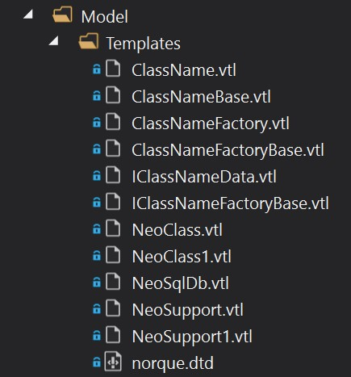

# OnePoint Global Entity Data Framework
Welcome to the OnePoint Global Entity Data Framework (OPGEDF). A set of libraries that supports access to Microsoft SQL 
Server and other databases. It provides a fast, light way to map a Database into code and prvoide a simple way to insert, 
update and delete data, with full access to stored procedures. It is based on the [NEO Framework](http://neo.sourceforge.net/).

## Introduction
This contains the documentation to use the OPGEDF. This guide contains:
1. Current Status
2. The OnePoint Modeller
3. [Using Your Model](Using.md)
4. [Custom Queries](Custom.md)
5. [Updating Your Model](Update.md)
6. [Managing Relational Databases](Relational.md)
7. [Custom Properties](Custom.md)
8. [Asynchonrous Database Access](Asynchronous.md)
9. [Dynamic Datatables](Datatable.md)
10. [Housekeeping](Rules.md)

### Current Status
The OPGEDF is currently undergoing some enhancements to support asynchronous access to MS SQL Server, but the library and 
tools are stable and will support existing projects.

### Reporting Issues
OnePoint Global takes the quality of its software serious and customer satisfaction is extremely important. 
If you experience and issue then you should report it through the public GitHub Issues. 
If you believe the the issue is related to the security of the service then please contact us directly.

## The OnePoint Modeller
The OnePoint Modeller is a tool that provides fast mapping of a Microsoft SQL Database into c# for immediate use in an application. The Modeller is based around a an XML language and a set of templates that are used to generate the c# code. The example below shows a sample of an XML model:
```
<?xml version="1.0" encoding="utf-8" standalone="no"?>
<!DOCTYPE database SYSTEM "Templates\norque.dtd">
<?neo path="templates"?>
<?neo userfileextension=".cs"?>
<?neo supportfileextension=".cs"?>
<?neo support="IClassNameData.vtl,IClassNameFactoryBase.vtl,ClassNameBase.vtl,ClassNameFactoryBase.vtl"?>
<?neo user="ClassName.vtl,ClassNameFactory.vtl"?>

<database name="$db{Framework}" package="OnePoint.PROM.Model" defaultJavaNamingMethod="javaname" defaultIdMethod="native">
  <!--START-PROJECT-STRUCTURE -->
  <table name="Groups" database="$db{Framework}" javaName="Groups">
    <column name="GroupID"  type="BIGINT" javaType="BIGINT" required="true" primaryKey="true" autoIncrement="true"  description=""  />
    <column name="UserID" type="BIGINT" javaType="BIGINT" required="true" description="" />
    <column name="Name"  type="LONGVARCHAR" javaType="TEXT" required="true" size="1024" />
    <column name="Description"  type="LONGVARCHAR" javaType="TEXT" required="true" size="4000" />
    <column name="CreatedDate"  type="DATE" javaType="DATE" required="true"  />
    <column name="LastUpdatedDate"  type="DATE" javaType="DATE" required="true" />
    <column name="ParentGroupID" type="BIGINT" javaType="BIGINT" required="true" description="" />
    <column name="Level" type="BIGINT" javaType="BIGINT" required="true" description="" />
    <column name="RefID" type="INTEGER" javaType="BIGINT" required="true" description="" />
  </table>
</database>
```

This is converted into a set of c# classes:

Name | Description
---- | -----------
Groups.cs | A simple class that inherits the GroupsBase.cs for custom code.
GroupsBase.cs | A class that maps the data layout of the Microsoft SQL DB table.
GroupsFactory.cs | A simple class that inheirts the GroupsFactoryBase.cs for custom data access definition.
GroupsFactoryBase.cs | A class that include all the basic code for accessing an mapping the database table to c#.
IGroupsData.cs | Interface to the base data layout.
IGroupsFactoryData.cs | Interface to the base factory for accessing the data.

## Visual Studio Modeller Extension
The Modeller is available for use with Microsoft Visual Studio 2019 and can be downloaded from [here](/VisualStudio).

### Steps to using the Modeller
1. Create a new project or a new folder in an existing project.
2. In the folder create another folder called Templates.
3. In the Templates folder add the templates, which can be downloaded from [here](/VisualStudio/Templates).
4. In the new folder create your model.xml file and place your Entity model definition in there.
5. Change the `Custom Tool` property of the model.xml to `OnePointModeller`.
6. Save the `model.xml` file and in doing so it will generate the code c# files in the same folder.

In your Visual Studio project you should have a folder structure that looks similar to this:



In order to compile the code you will need to include a couple of librearies from Nuget:

Name | Description
---- | -----------
OnePoint.Data | The main data access library. Currently geared towards Microsoft SQL Server.
OnePoint.Logging | A wrapper used by OnePoint.Data to access log4net.
log4net | A logging facility.

## Using Your Model
To find out more about using your model [click here](Using.md).


